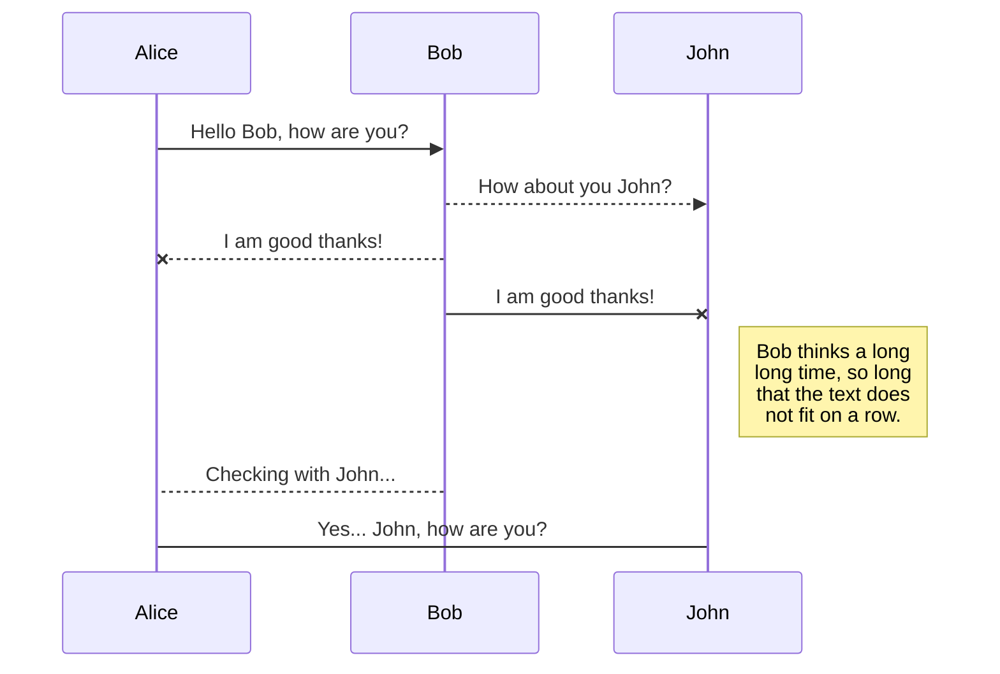
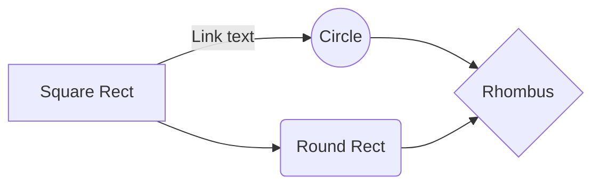

# MD Section Headline

Sample paragraph with **bold text** and *italic* text. 

## Subsection Heading

### Blockquote
	> Details on code section

## Save a file


# Publication

Publishing in StackEdit makes it simple for you to publish online your files. Once you're happy with a file, you can publish it to different hosting platforms like **Blogger**, **Dropbox**, **Gist**, **GitHub**, **Google Drive**, **WordPress** and **Zendesk**. With [Handlebars templates](http://handlebarsjs.com/), you have full control over what you export.

> Before starting to publish, you must link an account in the **Publish** sub-menu.
> > **Note:** The **Publish now** button is disabled if your file has not been published yet.

## Publish a File

You can publish your file by opening the **Publish** sub-menu and by clicking **Publish to**. For some locations, you can choose between the following formats:

- Markdown: publish the Markdown text on a website that can interpret it (**GitHub** for instance),
- HTML: publish the file converted to HTML via a Handlebars template (on a blog for example).

## Update a publication

After publishing, StackEdit keeps your file linked to that publication which makes it easy for you to re-publish it. Once you have modified your file and you want to update your publication, click on the **Publish now** button in the navigation bar.

---

> **Note:** The **Publish now** button is disabled if your file has not been published yet.
---
### Table
|                |Supported Versions             |Notes|
|----------------|-------------------------------|-----------------------------|
|Technology			 |`v1.0`            |Enter Note            |

> You can find more information about **LaTeX** mathematical expressions [here](http://meta.math.stackexchange.com/questions/5020/mathjax-basic-tutorial-and-quick-reference).

---

#### Other for copy and paste
- [ ] Tasklist
Highlighting ==very important words==.
Subscript: H~2~O
Superscript: X^2^

[Example Link](https://www.example.com)

**Definition List:**

term  
: definition

Code Blocks
#### JSON

```  json
{  
"firstName": "John",  
"lastName": "Smith",  
"age": 25  
}  
```
#### PHP
```  php
$username = "spartanbyte"; 
```
#### JavaScript
``` js
var username = "spartanbyte"

// react 
import React from 'react';

const Greet = () => {
  return (
    <h1>Hello World!</h1>
  );
};

export default Greet;

// next.js
export default function Home() {
  return (
    <Example Component/>
  );
}

// vue.js
<script setup>
import { ref } from 'vue';

// A "ref" is a reactive data source
const message = ref('Hello World!');
</script>

<template>
  <h1>{{ message }}</h1>
</template>

<style scoped>
/* Scoped styles only apply to this component */
h1 {
  color: #42b883; /* Vue green */
}
</style>
```
Bash
``` bash
aws config
```
``` python 
python_string = "django"
```

``` ruby
ruby_string = "ruby on rails"
```

```csharp
using System;

namespace CSharpSyntaxHighlighting
{
  class Program
  {
    static void Main(string[] args)
    {
      Console.WriteLine("Syntax highlighting makes life easier.");    
    }
  }
}
```

``` java
public class Main {
  public static void main(String[] args) {
    System.out.println("Syntax highlighting makes life easier.");
  }
}
```

``` sql
SELECT * FROM Users;
```
``` xml
<?xml version="1.0"  encoding="UTF-8"?>  
<note>  
<to>Tove</to>  
<from>Jani</from>  
<heading>Reminder</heading>  
<body>Don't forget me this weekend!</body>  
</note>
```

``` css
header {background: #000;};
```


## UML diagrams

You can render UML diagrams using [Mermaid](https://mermaidjs.github.io/). For example, this will produce a sequence diagram:



And this will produce a flow chart:

